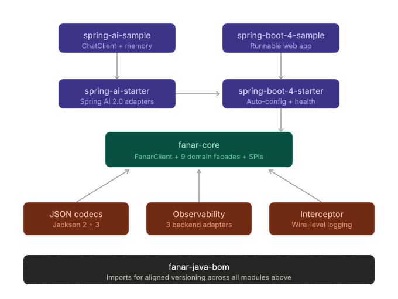

# Fanar Java SDK

Java SDK for [Fanar](https://fanar.qa) — Qatar's Arabic-centric multimodal AI platform.

> **Status:** pre-1.0. The core SDK and all nine Fanar domains (chat, audio, images, translations,
> moderations, sadiq, tokens, models, poems) are implemented against the 2026-09 Fanar spec —
> madhab-aware `Fanar-Sadiq-2`, Qur'an + hadith quotation validation, custom personas, streamed and
> emotional TTS, the voice catalogue, culturally-aligned image prompt revision — with 100 % JaCoCo
> coverage and a live test suite run against the real API. Every domain but `sadiq` is exercised
> live; the validation endpoint is gated for our key, so its behaviour follows the spec rather than
> an observation ([wire observations](docs/WIRE_OBSERVATIONS.md)). Spring Boot 4 and Spring AI 2.0
> starters ship with a sample app each.
> Requires **Java 21+**. Not yet on Maven Central — install via `./mvnw install` for now.

## Why this SDK?

**To open Fanar to the Java world.** Java runs a large share of production systems in enterprise,
finance, government, telco and research, and the JVM ecosystem has invested heavily in AI. This SDK
puts Fanar in the shape those codebases already expect — Spring Boot apps, Spring AI providers,
GraalVM native binaries, plain-JDK code, Kotlin.

And yes — you *could* point an OpenAI-compatible client at `https://api.fanar.qa/v1` and get
basic chat. **But Fanar is not OpenAI.** Islamic RAG with authenticated source references,
Quranic TTS with validated tajweed, Arabic poetry through a dedicated model, cultural-awareness
scoring in moderation, bilingual progress events during streaming, two distinct thinking-mode
protocols, a vision model that understands Arabic calligraphy. None of that fits in an
OpenAI-shaped client.

The core SDK is a **thin, pluggable, observable transport** over the Fanar API — nothing more.
Memory, templating, vectors, evaluation belong in **framework modules** on top.

## Quick start

Four install paths depending on your stack.

### 1. Pure Java (any framework, no Spring)

```xml
<dependencies>
    <dependency>
        <groupId>qa.fanar</groupId>
        <artifactId>fanar-core</artifactId>
        <version>0.7.0-SNAPSHOT</version>
    </dependency>
    <dependency>
        <groupId>qa.fanar</groupId>
        <artifactId>fanar-json-jackson3</artifactId>     <!-- or fanar-json-jackson2 -->
        <version>0.7.0-SNAPSHOT</version>
    </dependency>
</dependencies>
```

```java
try (FanarClient client = FanarClient.builder().apiKey(System.getenv("FANAR_API_KEY")).build()) {
    ChatResponse r = client.chat().send(ChatRequest.builder()
            .model(ChatModel.FANAR)
            .addMessage(UserMessage.of("Say hello in Arabic"))
            .build());
    System.out.println(r.choices().getFirst().message().content());
}
```

### 2. Spring Boot 4

```xml
<dependency>
    <groupId>qa.fanar</groupId>
    <artifactId>fanar-spring-boot-4-starter</artifactId>
    <version>0.7.0-SNAPSHOT</version>
</dependency>
```

```yaml
fanar:
  api-key: ${FANAR_API_KEY}
  wire-logging:
    level: BASIC                   # NONE | BASIC | HEADERS | BODY
```

```java
@RestController
class MyController {
    @Autowired FanarClient fanar;   // auto-wired; /actuator/health includes Fanar reachability
}
```

### 3. Spring AI 2.0

```xml
<dependency>
    <groupId>qa.fanar</groupId>
    <artifactId>fanar-spring-ai-starter</artifactId>
    <version>0.7.0-SNAPSHOT</version>
</dependency>
```

```java
@Bean
ChatClient chatClient(ChatModel model, ChatMemory memory) {     // Spring AI types
    return ChatClient.builder(model)
            .defaultAdvisors(MessageChatMemoryAdvisor.builder(memory).build())
            .build();
}
// Now the standard Spring AI surface — memory, RAG advisors, prompt templates — works
// with Fanar as the provider. ImageModel, TextToSpeechModel, TranscriptionModel beans
// auto-register too.
```

### 4. Google ADK (no Spring)

```xml
<dependency>
    <groupId>qa.fanar</groupId>
    <artifactId>fanar-adk</artifactId>
    <version>0.7.0-SNAPSHOT</version>
</dependency>
```

```java
FanarLlm model = new FanarLlm(() -> FanarClient.builder().build(), ChatModel.FANAR); // key from FANAR_API_KEY
LlmAgent agent = LlmAgent.builder().name("fanar").model(model).instruction("Answer in Arabic.").build();
```

ADK itself stays the application's dependency; the adapter brings the Jackson 2 codec ADK's classpath
already satisfies. Tool declarations and output schemas are refused by default because Fanar's chat
endpoint silently ignores them ([ADR-030](docs/adr/030-google-adk-adapter.md)).

## Modules

| Module | Purpose |
|---|---|
| `fanar-core` | Typed client + SPIs + every Fanar domain. Zero runtime deps. |
| `fanar-json-jackson2` / `fanar-json-jackson3` | JSON codec adapters (pick by Jackson version). |
| `fanar-obs-slf4j` / `fanar-obs-otel` / `fanar-obs-micrometer` | `ObservabilityPlugin` adapters; opt-in. |
| `fanar-interceptor-logging` | OkHttp-style wire-logging interceptor. |
| `fanar-spring-boot-4-starter` | `@AutoConfiguration` + `fanar.*` properties + actuator health. |
| `fanar-spring-boot-4-sample` | Runnable sample app. |
| `fanar-spring-ai-starter` | Spring AI 2.0 `ChatModel` / `ImageModel` / `TextToSpeechModel` / `TranscriptionModel` adapters. |
| `fanar-spring-ai-sample` | Runnable sample app with `ChatClient` + memory. |
| `fanar-adk` | Google ADK Java `BaseLlm` adapter (`FanarLlm`) — no Spring required. |
| `fanar-java-bom` | Imports for aligned versioning. |

<p align="center">
  
</p>

## Docs

- [Project state](docs/PROJECT_STATE.md) — what's shipped, planned, deferred.
- [Compatibility matrix](docs/COMPATIBILITY.md) — capability map: Fanar ↔ core ↔ framework layer.
- [Wire observations](docs/WIRE_OBSERVATIONS.md) — dated ledger of what the live API does where it differs from the spec, and the live-suite budget.
- [Architecture](docs/ARCHITECTURE.md) — module layout, request-flow diagrams, where things live.
- [API sketch](docs/API_SKETCH.md) — concrete code shapes for every call.
- [GraalVM walkthrough](docs/GRAALVM.md) — native-image build, end-to-end.
- [Glossary](docs/GLOSSARY.md) — Fanar-specific and project-specific terminology.
- [ADRs](docs/adr/INDEX.md) — non-obvious design decisions.
- [Library best practices](docs/JAVA_LIBRARY_BEST_PRACTICES.md) — internal hygiene rules.
- [Contributing](docs/CONTRIBUTING.md) — workflow, conventions.
- [Releasing](docs/RELEASING.md) — maintainer runbook for cutting a release.
- [Fanar OpenAPI spec](api-spec/openapi.json) — the wire contract we model (normative; [YAML twin](api-spec/openapi.yaml) provided for convenience).
