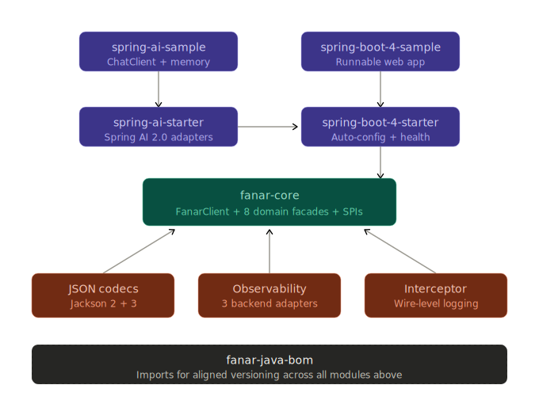
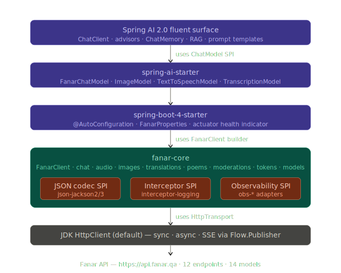

# Architecture

> OpenAPI 3.1.0 — 12 endpoints, 14 models

---

## 1. Fanar API surface

**Base URL:** `https://api.fanar.qa` · **Auth:** Bearer token · **Compatibility:** OpenAI-compatible

### Endpoints

| Method | Path                       | Domain      | Content type  |
|--------|----------------------------|-------------|---------------|
| POST   | `/v1/chat/completions`     | Chat        | JSON / SSE    |
| POST   | `/v1/audio/speech`         | Audio       | JSON → binary |
| POST   | `/v1/audio/transcriptions` | Audio       | multipart     |
| GET    | `/v1/audio/voices`         | Audio       | JSON          |
| POST   | `/v1/audio/voices`         | Audio       | multipart     |
| DELETE | `/v1/audio/voices/{name}`  | Audio       | —             |
| POST   | `/v1/images/generations`   | Image       | JSON          |
| POST   | `/v1/translations`         | Translation | JSON          |
| POST   | `/v1/poems/generations`    | Poetry      | JSON          |
| POST   | `/v1/moderations`          | Safety      | JSON          |
| POST   | `/v1/tokens`               | Utility     | JSON          |
| GET    | `/v1/models`               | Utility     | JSON          |

### Models

| Model ID              | Rate limit | Domain             |
|-----------------------|------------|--------------------|
| `Fanar`               | 50/min     | Chat router        |
| `Fanar-S-1-7B`        | 50/min     | Chat (Star)        |
| `Fanar-C-1-8.7B`      | 50/min     | Chat (thinking v1) |
| `Fanar-C-2-27B`       | 50/min     | Chat (thinking v2) |
| `Fanar-Sadiq`         | 50/min     | Islamic RAG        |
| `Fanar-Oryx-IVU-2`    | 20/day     | Vision             |
| `Fanar-Aura-TTS-2`    | 20/day     | TTS                |
| `Fanar-Sadiq-TTS-1`   | 20/day     | Quranic TTS        |
| `Fanar-Aura-STT-1`    | 20/day     | STT short          |
| `Fanar-Aura-STT-LF-1` | 10/day     | STT long-form      |
| `Fanar-Oryx-IG-2`     | 20/day     | Image generation   |
| `Fanar-Guard-2`       | 50/min     | Moderation         |
| `Fanar-Shaheen-MT-1`  | 20/day     | Translation        |
| `Fanar-Diwan`         | 50/min     | Poetry             |

---

## 2. SDK architecture

### Module layout

<p align="center">
  
</p>

```
fanar-java                            (reactor parent — NOT published)
├── core/                             qa.fanar:fanar-core                   — jar
│   └── src/main/java/
│       ├── module-info.java          module qa.fanar.core
│       └── qa/fanar/core/
│           ├── FanarClient, FanarException, …                  (top-level public API)
│           ├── chat/  audio/  images/  translations/  poems/
│           ├── moderations/  tokens/  models/                  (domain packages)
│           ├── spi/                                            (Interceptor, FanarJsonCodec, ObservabilityPlugin)
│           └── internal/                                       (transport, SSE parser, retry — not exported)
├── json-jackson2/                    qa.fanar:fanar-json-jackson2          — jar  (Jackson 2 codec; pair with SB3)
├── json-jackson3/                    qa.fanar:fanar-json-jackson3          — jar  (Jackson 3 codec; pair with SB4)
├── obs-slf4j/                        qa.fanar:fanar-obs-slf4j              — jar  (ObservabilityPlugin → SLF4J)
├── obs-otel/                         qa.fanar:fanar-obs-otel               — jar  (ObservabilityPlugin → OpenTelemetry)
├── obs-micrometer/                   qa.fanar:fanar-obs-micrometer         — jar  (ObservabilityPlugin → Micrometer)
├── interceptor-logging/              qa.fanar:fanar-interceptor-logging    — jar  (wire-level request/response logging)
├── spring-boot-4-starter/            qa.fanar:fanar-spring-boot-4-starter  — jar  (auto-config + actuator health for SB4)
├── spring-boot-4-sample/             qa.fanar:fanar-spring-boot-4-sample   — jar  (runnable sample; not published)
├── spring-ai-starter/                qa.fanar:fanar-spring-ai-starter      — jar  (Spring AI 2.0 ChatModel/Image/TTS/STT adapters)
├── spring-ai-sample/                 qa.fanar:fanar-spring-ai-sample       — jar  (runnable sample; not published)
├── e2e/                              qa.fanar:fanar-java-e2e               — jar  (live integration tests; not published)
├── e2e-graalvm/                      qa.fanar:fanar-java-e2e-graalvm       — jar  (native-image self-test + live walk; not published)
└── bom/                              qa.fanar:fanar-java-bom               — pom  (dependency management for consumers)
```

Each library module ships a `module-info.java`. The samples and the Spring Boot 4 starter run on
the classpath (no JPMS) because Spring jars don't fully declare modules; `spring-ai-starter`
follows the same posture for the same reason. The reactor parent is never published; consumers
import the BOM.

### Framework adapter layering

<p align="center">
  
</p>

The framework story is two slices stacked over the core, each adapter a sibling Maven module:

```
       ┌─────────────────────────────────────────────────────────────────┐
       │  Spring AI fluent surface — ChatClient, advisors, ChatMemory,   │
       │  RAG / vector store / structured-output converters              │
       └─────────────────────────────────────────────────────────────────┘
                                    ▲ uses Spring AI's ChatModel SPI
       ┌─────────────────────────────────────────────────────────────────┐
       │  fanar-spring-ai-starter                                        │
       │  FanarChatModel + FanarImageModel + FanarTextToSpeechModel +    │
       │  FanarTranscriptionModel + FanarSpringAiAutoConfiguration       │
       └─────────────────────────────────────────────────────────────────┘
                                    ▲ uses FanarClient
       ┌─────────────────────────────────────────────────────────────────┐
       │  fanar-spring-boot-4-starter                                    │
       │  FanarAutoConfiguration + FanarProperties +                     │
       │  FanarHealthAutoConfiguration                                   │
       └─────────────────────────────────────────────────────────────────┘
                                    ▲ uses FanarClient builder + SPIs
       ┌─────────────────────────────────────────────────────────────────┐
       │  fanar-core   +   fanar-json-jackson3   +   fanar-obs-* (opt)   │
       │  fanar-interceptor-logging (opt)                                │
       └─────────────────────────────────────────────────────────────────┘
                                    ▲ uses HttpTransport SPI
                          JDK HttpClient (default)
```

Memory, prompt templating, RAG advisors, structured-output converters, vector stores all live
in Spring AI; we expose `ChatModel` (the SPI) and they compose on top. We never have to update
those features; tracking Spring AI's milestones suffices.

### Request flow — sync call

```
user code
    │
    │  client.chat().send(request)
    ▼
ChatClient (domain facade)                                                 qa.fanar.core.chat.ChatClient
    │
    │  validate → pick endpoint → start observation
    ▼
ObservabilityPlugin.start("fanar.chat")  ──────►  ObservationHandle   (AutoCloseable)
    │
    │  encode body via FanarJsonCodec, build HttpRequest, attach propagationHeaders()
    ▼
Interceptor chain (registration order: first-added is outermost)
    │
    ├─ BearerTokenInterceptor         adds Authorization header
    │
    ├─ RetryInterceptor               wraps the rest; retries on typed retryable errors
    │                                 emits observation.event("retry_attempt")
    │
    ├─ <user interceptors>            Chain.proceed(request) invokes the next link
    │
    ▼
JDK HttpClient.send(req, BodyHandlers.ofInputStream())                     qa.fanar.core.internal.transport
    │                                                                       (IOException → FanarTransportException)
    │
    ▼  HttpResponse
Interceptor chain unwinds (post-processing)
    │
    │  decode body via FanarJsonCodec, surface errors as typed FanarException subtypes
    ▼
ChatResponse                                                                qa.fanar.core.chat.ChatResponse
```

All on the caller's thread. On a virtual thread, the blocking I/O does not tie up a carrier (ADR-004).

### Request flow — streaming call

```
user code  ──────────► client.chat().stream(request)
                                    │
                                    │ (same as sync up to the HTTP call: validate, observation,
                                    │  interceptors, encode, send — but with BodyHandlers.ofLines())
                                    ▼
                       HttpClient.sendAsync(req, BodyHandlers.ofLines())    qa.fanar.core.internal.transport
                                    │
                                    ▼
                       Flow.Publisher<String>          (one line per item)
                                    │
                                    │ accumulate into SSE frames:          qa.fanar.core.internal.sse
                                    │   data: / event: / id: / blank line = dispatch
                                    ▼
                       per frame: FanarJsonCodec.decode(...) into
                                    │   the right StreamEvent subtype by shape
                                    ▼
                       Flow.Publisher<StreamEvent>  ◄── returned to caller
```

The caller's `Flow.Subscriber<StreamEvent>` consumes events as they arrive and pattern-matches on the sealed
`StreamEvent` hierarchy (ADR-005). Interceptors apply to the initial connection handshake only; mid-stream events
bypass them.

### Seams (extension points)

| Seam | SPI / config slot | Default if not set |
|---|---|---|
| HTTP transport | `.httpClient(HttpClient custom)` | JDK `HttpClient` built by the client, closed on `FanarClient.close()` |
| JSON codec | `FanarJsonCodec` via `.jsonCodec(codec)` or `ServiceLoader` | `ServiceLoader` discovery; **loud error** at `build()` if none found |
| Observability | `ObservabilityPlugin` via `.observability(plugin)` | No-op plugin |
| Interceptors | `.addInterceptor(i)` (registration order = chain order) | `BearerTokenInterceptor` (if apiKey set) + `RetryInterceptor` |
| Retry policy | `.retryPolicy(policy)` | `RetryPolicy.defaults()` — 3 attempts, exponential + full jitter, 30 s cap |
| User-Agent | `.userAgent(ua)` | `fanar-java/<version>` |
| Default headers | `.defaultHeader(name, value)` (repeated) | none |

Every seam is an interface; every default lives behind the builder's "if-not-set" guard. Core imports no third-party
runtime types — all seams use JDK types or our own interfaces (ADR-003, ADR-007, ADR-008, ADR-012, ADR-013).

### Error model

```
FanarException               (sealed, unchecked)
├── FanarTransportException  (wraps IOException / InterruptedException from transport)
├── FanarContentFilterException
├── FanarClientException     (sealed 4xx)
│   ├── FanarAuthenticationException
│   ├── FanarAuthorizationException
│   ├── FanarQuotaExceededException
│   ├── FanarNotFoundException
│   ├── FanarConflictException
│   ├── FanarTooLargeException
│   ├── FanarUnprocessableException
│   └── FanarGoneException
└── FanarServerException     (sealed 5xx)
    ├── FanarRateLimitException
    ├── FanarOverloadedException
    ├── FanarTimeoutException
    └── FanarInternalServerException
```

One subtype per Fanar `ErrorCode` plus `FanarTransportException` for JDK-transport failures. See ADR-006.

---

## 3. Where things live

Lookup table for "I want to change X, where's X?". Everything below is implemented; status notes
flag whether the type is part of the public contract or the freely-refactorable `.internal.*`
zone (ADR-018).

| Concern | Package | Status |
|---|---|---|
| Public entry point | `qa.fanar.core.FanarClient` (+ nested `Builder`) | **implemented** — wires the transport, bearer-token interceptor, and `ChatClientImpl` |
| Chat domain facade | `qa.fanar.core.chat.ChatClient` | **implemented** (interface); `qa.fanar.core.internal.chat.ChatClientImpl` runs `send` / `sendAsync` / `stream` end-to-end |
| Exception hierarchy root | `qa.fanar.core.FanarException` | **implemented** (sealed, 13 subtypes) |
| Error-code enum | `qa.fanar.core.ErrorCode` | **implemented** |
| Content-filter-type record | `qa.fanar.core.ContentFilterType` | **implemented** — open value class (record) with constants + `of(String)` factory |
| Domain DTOs — chat messages | `qa.fanar.core.chat.Message` + variants + content parts + `ToolCall` | **implemented** |
| Domain DTOs — chat value classes | `qa.fanar.core.chat.{ChatModel, Source, ImageDetail, FinishReason, BookName}` | **implemented** — open value-class records with constants + permissive `of(String)`; `BookName` carries 572 inline `KNOWN` entries from `BookNamesEnum` |
| `ChatRequest` (+ `Builder`) | `qa.fanar.core.chat.ChatRequest` | **implemented** (31-component record, fluent builder) |
| `ChatResponse` + response types | `qa.fanar.core.chat.{ChatResponse, ChatChoice, ChatMessage, Reference, FinishReason, ResponseContent, TextContent, ImageContent, AudioContent, CompletionUsage, CompletionTokensDetails, PromptTokensDetails, ChoiceLogprobs, TokenLogprob, TopLogprob}` | **implemented** |
| Other domain DTOs + clients | `qa.fanar.core.<audio\|images\|translations\|poems\|moderations\|tokens\|models>` | **implemented** — per-domain client interface, open value-class records, and DTOs; each surfaced via `client.audio()` / `.images()` / `.translations()` / `.poems()` / `.moderations()` / `.tokens()` / `.models()`. Audio additionally exposes a sealed `SpeechToTextResponse` with text / srt / json variants. |
| Sealed `StreamEvent` hierarchy | `qa.fanar.core.chat.{StreamEvent, TokenChunk, ToolCallChunk, ToolResultChunk, ProgressChunk, DoneChunk, ErrorChunk, ChoiceToken, ChoiceToolCall, ChoiceToolResult, ChoiceFinal, ChoiceError, ProgressMessage, FunctionData, ToolCallData, ToolResultData}` | **implemented** |
| Extension SPIs | `qa.fanar.core.spi` | **implemented** (FanarJsonCodec, Interceptor+Chain, ObservabilityPlugin, ObservationHandle, FanarObservationAttributes) |
| Default no-op observability | `qa.fanar.core.internal.observability` | **implemented** (NoopObservabilityPlugin, NoopObservationHandle) |
| Composite observability | `qa.fanar.core.internal.observability.CompositeObservabilityPlugin` | **implemented** — produced by `ObservabilityPlugin.compose(...)`; fans out `start` / `attribute` / `event` / `error` / `child` to N children, merges `propagationHeaders` (last-write-wins on key collision) |
| Retry policy (public) | `qa.fanar.core.RetryPolicy` + `qa.fanar.core.JitterStrategy` | **implemented** (record + enum; retry loop still to come) |
| HTTP transport | `qa.fanar.core.internal.transport` (`HttpTransport`, `DefaultHttpTransport`, `InterceptorChainImpl`, `ExceptionMapper`) | **implemented** |
| Bearer-token interceptor impl | `qa.fanar.core.internal.transport.BearerTokenInterceptor` | **implemented** — per-call `Supplier<String>` for token rotation |
| SSE parser | `qa.fanar.core.internal.sse` (`SseFrameAssembler`, `StreamEventDecoder`, `SseStreamPublisher`) | **implemented** — line-oriented accumulator, shape-routed decode, single-subscriber `Flow.Publisher<StreamEvent>` on a virtual thread |
| Retry interceptor impl | `qa.fanar.core.internal.retry.RetryInterceptor` | **implemented** — exponential back-off with configurable jitter, `Retry-After` honouring on 429, `retry_attempt` observation events, injectable `Sleeper`+`RandomGenerator` |
| Jackson 2 codec | `qa.fanar.json.jackson2.Jackson2FanarJsonCodec` | **implemented** — snake-case naming, NON_NULL inclusion, six flattening deserializers, generic wire-value module (records or enums via `wireValue()` / `of(String)`), `ServiceLoader` descriptor, reachability metadata |
| Jackson 3 codec | `qa.fanar.json.jackson3.Jackson3FanarJsonCodec` | **implemented** — snake-case naming, NON_NULL inclusion, six flattening deserializers, generic wire-value module (records or enums via `wireValue()` / `of(String)`), `ServiceLoader` descriptor, reachability metadata |
| SLF4J observability adapter | `qa.fanar.obs.slf4j.Slf4jObservabilityPlugin` | **implemented** — one structured log line per operation through SLF4J at `DEBUG` (success) / `ERROR` (failure); per-operation logger names (`fanar.chat.send`, `fanar.audio.speech`, ...); attribute filter / redactor knobs via builder; `provided`-scope SLF4J |
| OpenTelemetry observability adapter | `qa.fanar.obs.otel.OpenTelemetryObservabilityPlugin` | **implemented** — one OTel span per operation, typed attribute dispatch (long / double / boolean / String), W3C `traceparent` injection via `propagationHeaders()`, parent-child via captured context (survives virtual-thread async hops); attribute filter / redactor knobs; `provided`-scope OpenTelemetry API |
| Micrometer observability adapter | `qa.fanar.obs.micrometer.MicrometerObservabilityPlugin` | **implemented** — one Micrometer `Observation` per operation; attributes → low-cardinality `KeyValue`s for metric tags; backend (metrics / tracing) wired by the consuming application's `ObservationRegistry`; `provided`-scope `micrometer-observation` |
| Wire logging interceptor | `qa.fanar.interceptor.logging.WireLoggingInterceptor` | **implemented** — OkHttp-style level ladder (`NONE` / `BASIC` / `HEADERS` / `BODY`), SLF4J sink at `fanar.wire`, configurable header redaction (default `Authorization`), body byte cap, streaming-aware (skips `text/event-stream` bodies); `provided`-scope SLF4J |
| Spring Boot 4 auto-configuration | `qa.fanar.spring.boot.v4.FanarAutoConfiguration` + `FanarProperties` | **implemented** — typed `fanar.*` `@ConfigurationProperties` record (api-key, base-url, timeouts, retry, wire-logging level), `FanarClient` bean with auto-wired `Interceptor` + `ObservabilityPlugin` via `ObjectProvider`, default Jackson 3 codec |
| Spring Boot 4 health indicator | `qa.fanar.spring.boot.v4.FanarHealthIndicator` + `FanarHealthAutoConfiguration` | **implemented** — `AbstractHealthIndicator` calling `models().list()`; activates only when `spring-boot-health` is on the classpath (`provided + optional`); UP carries model count + request id, DOWN carries error class + HTTP status; gated by `management.health.fanar.enabled` |
| Spring AI 2.0 chat adapter | `qa.fanar.spring.ai.FanarChatModel` | **implemented** — `ChatModel` + `StreamingChatModel`; maps `Prompt` / `ChatOptions` onto `ChatRequest`, bridges `Flow.Publisher<StreamEvent>` to `Flux<ChatResponse>`, drops TOOL messages and `ProgressChunk` / `ToolCallChunk` / `ToolResultChunk` (Fanar's tool calls are server-internal Sadiq retriever telemetry, not user tools) |
| Spring AI 2.0 image adapter | `qa.fanar.spring.ai.FanarImageModel` | **implemented** — `ImageModel`; maps `ImagePrompt` onto `ImageGenerationRequest`, joins multi-message prompts with newlines, returns `b64Json` |
| Spring AI 2.0 audio adapters | `qa.fanar.spring.ai.FanarTextToSpeechModel`, `FanarTranscriptionModel` | **implemented** — TTS satisfies `StreamingTextToSpeechModel` by wrapping the one-shot result as a single-element `Flux`; STT reads bytes from Spring's `Resource`, infers `Content-Type` from filename extension, always requests text format |
| Spring AI 2.0 auto-configuration | `qa.fanar.spring.ai.FanarSpringAiAutoConfiguration` | **implemented** — registers all four model beans `@ConditionalOnMissingBean` so users override per slot; activates after `FanarAutoConfiguration` |
| Reachability metadata | `META-INF/native-image/qa.fanar/<artifact>/` | **shipped** — `fanar-core` carries reflect-config + resource-config metadata for the 38 records the JSON codec touches; both JSON adapters carry adapter-specific metadata; obs / interceptor modules don't need any (no reflection) |

---

## References

- [Compatibility matrix](COMPATIBILITY.md) — capability view.
- [API sketch](API_SKETCH.md) — concrete code shapes for every call.
- [ADRs 010 + 011](adr/INDEX.md) — module and package conventions.
- [ADRs 007 + 008 + 017](adr/INDEX.md) — transport, JSON, SSE.
- [ADRs 012 + 013 + 014](adr/INDEX.md) — interceptor, observability, retry SPIs.
- [ADR 018](adr/018-internals-not-a-contract.md) — internals are not a contract.
